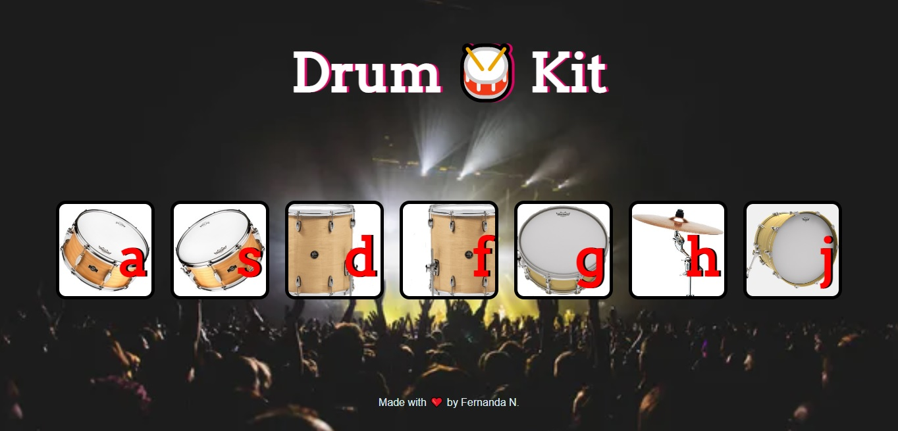

 

    <a href="https://github.com/Fernanda1701/drum-kit/blob/main/README.md">☆ Português Brasileiro</a>
    <a href="https://github.com/Fernanda1701/drum-kit/blob/main/README.eng.md">☆ English ☆</a> 

<h1 align="center">
    <a href="https://fernanda1701.github.io/drum-kit/">Drum 🥁 Kit</a>
</h1>

Drum Kit made in HTML, CSS and JavaScript

<h2 align="center">

</h2>

## 💎 About

The project was developed to fix basic knowledge in <b><i>JavaScript</b></i>.

### Operation

The <b>Drum Kit</b> is a Web App where you simulate the sounds of musical instruments, in this case a drum set. Just click or press the key of the 
respective letter described in the button and they will respond with their relative sounds. 
Below we have a demonstration of the functionality:

<h3 align="center">Drum Kit</h3>

  

To check out the webpage of <b>Drum 🥁 Kit</b> ➞ <a href="https://fernanda1701.github.io/drum-kit/">Click here!</a>

## 🛠 Technologies
 
- [HTML5](https://developer.mozilla.org/en-US/docs/Glossary/HTML5)
- [CSS3](https://devdocs.io/css/)
- [JavaScript](https://developer.mozilla.org/pt-BR/docs/Web/JavaScript)
- Code versioning on [Git](https://git-scm.com/)

## 💻 IDE

IDE used: [Atom](https://atom.io/)

## Author:

<a href="https://github.com/Fernanda1701">
 
  
 <b>Fernanda Nascimento</b></a> 

Contact Me ✉️:

